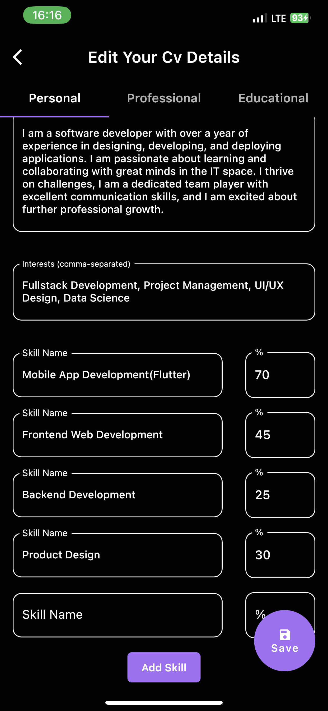

# Mobile CV Application

**Task: Mobile CV Application (HNGX Internship Task)**

This Flutter-based mobile application provides a comprehensive and interactive CV presentation platform, allowing users to view and edit personal and professional details conveniently. The app displays essential information like Full name, Slack username, GitHub handle, and a brief personal bio on the initial screen (CV View), providing a well-organized and easily accessible overview of the CV.

## Table of Contents

- [Mobile CV Application](#mobile-cv-application)
  - [Table of Contents](#table-of-contents)
  - [Overview](#overview)
  - [Features](#features)
  - [Screenshots](#screenshots)
  - [Demo](#demo)
  - [Setup Instructions](#setup-instructions)
  - [Usage](#usage)
  - [Contributing](#contributing)

## Overview

The Mobile CV Application is designed to showcase a personal CV in a clean and user-friendly interface. The application includes the following key features:

- **CV View (Home/First Page)**: Displaying personal and professional details.
- **Editing Capability**: Users can edit CV details by tapping the "Edit Details" button, which leads to a dedicated screen with user-friendly fields for modifying the existing CV data.
- **Real-time Updates**: After saving changes to the CV details, the application dynamically reflects the edits on the home/first page without requiring a manual refresh.
- **No Third-party Dependencies**: The application has been developed exclusively using Flutter's native capabilities, without integrating any third-party tools, packages, plugins, or libraries.

## Features

1. **CV View Screen**:

   - Initial screen upon opening the app.
   - Displays personal and professional details.
   - Pre-filled with default CV information.

2. **Editing Screen**:

   - Edit CV details using user-friendly input fields.
   - Dedicated screen for modifying the CV data.
   - Save changes to update the CV.

3. **Real-time Updates**:
   - Dynamic reflection of edits on the CV View screen.
   - No manual refresh needed after saving changes.

## Screenshots

Here are some screenshots of the application:

## Demo

To experience the app, you can access the [Mobile CV Application Demo](https://appetize.io/app/fq4pqmeq3ec2f5ctet3umtf3oe?device=pixel4&osVersion=11.0&scale=75) via Appetize.io.

## Setup Instructions

To set up the Mobile CV Application locally on your development environment, follow these steps:

1. Clone the repository to your local machine:
2. Navigate to the project directory:
3. Install the necessary dependencies using Flutter:
4. Run the application on your preferred emulator or connected device:

## Usage

1. Upon launching the application, the CV View (home/first page) will display pre-filled personal and professional information.

2. To edit the CV details:

- Tap the "Edit Details" button to access the editing screen.
- Modify the CV particulars using the provided user-friendly fields.
- Tap "Save" to save the changes and see real-time updates on the CV View screen.

## Contributing

Contributions to the Mobile CV Application are welcome! If you'd like to contribute, please follow these guidelines:

- Fork the repository and create a new branch for your contribution.
- Make your changes and submit a pull request.
